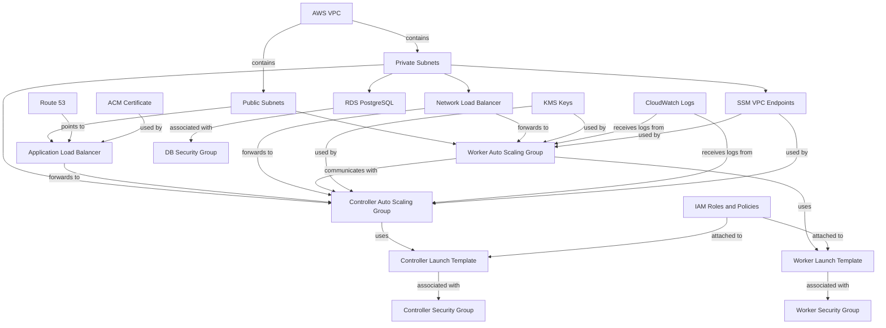

# Boundary on AWS Architecture

This diagram represents the high-level architecture of the Boundary deployment on AWS using this Terraform module.

```mermaid
graph TD
    VPC[AWS VPC] --> |contains| PublicSubnets[Public Subnets]
    VPC --> |contains| PrivateSubnets[Private Subnets]

    PublicSubnets --> ALB[Application Load Balancer]
    PublicSubnets --> WorkerASG[Worker Auto Scaling Group]
    PrivateSubnets --> NLB[Network Load Balancer]
    PrivateSubnets --> RDS[RDS PostgreSQL]
    PrivateSubnets --> ControllerASG[Controller Auto Scaling Group]
    PrivateSubnets --> SSMEndpoints[SSM VPC Endpoints]

    ALB --> |forwards to| ControllerASG
    NLB --> |forwards to| ControllerASG
    NLB --> |forwards to| WorkerASG
    WorkerASG --> |communicates with| ControllerASG

    ControllerASG --> |uses| ControllerLT[Controller Launch Template]
    WorkerASG --> |uses| WorkerLT[Worker Launch Template]

    ControllerLT --> |associated with| ControllerSG[Controller Security Group]
    WorkerLT --> |associated with| WorkerSG[Worker Security Group]

    RDS --> |associated with| DBSG[DB Security Group]

    KMS[KMS Keys] --> |used by| ControllerASG
    KMS --> |used by| WorkerASG

    Route53[Route 53] --> |points to| ALB

    ACM[ACM Certificate] --> |used by| ALB

    IAM[IAM Roles and Policies] --> |attached to| ControllerLT
    IAM --> |attached to| WorkerLT

    CloudWatchLogs[CloudWatch Logs] --> |receives logs from| ControllerASG
    CloudWatchLogs --> |receives logs from| WorkerASG

    SSMEndpoints --> |used by| ControllerASG
    SSMEndpoints --> |used by| WorkerASG
```
