# Low-Level Architecture

## Network Configuration

1. **VPC**: The module uses an existing VPC provided by the user.
2. **Subnets**:
   - Public subnets for the ALB
   - Private subnets for controllers, workers, and RDS

## Load Balancers

1. **Application Load Balancer (ALB)**:

   - Public-facing
   - Listens on port 443 (HTTPS)
   - Uses security group: `aws_security_group.boundary_lb`
   - Target group: `aws_lb_target_group.boundary_lb_controller`

2. **Network Load Balancer (NLB)**:
   - Internal
   - Listens on port 9201 (TCP)
   - Target group: `aws_lb_target_group.boundary_lb_worker`

## Boundary Controllers

1. **Auto Scaling Group**:

   - Uses launch template: `aws_launch_template.boundary_controller`
   - Deployed in private subnets
   - Attached to both ALB and NLB target groups

2. **Security Group**: `aws_security_group.boundary_controller`

   - Allows inbound traffic on ports 9200 (from ALB) and 9201 (from NLB)
   - Allows outbound traffic to RDS and internet

3. **IAM Role**: Attached to the launch template for necessary AWS permissions

## Boundary Workers

1. **Auto Scaling Group**:

   - Uses launch template: `aws_launch_template.boundary_worker`
   - Deployed in private subnets
   - Attached to NLB target group

2. **Security Group**: `aws_security_group.boundary_worker`

   - Allows inbound traffic on port 9201 (from NLB)
   - Allows outbound traffic to targets and internet

3. **IAM Role**: Attached to the launch template for necessary AWS permissions

## Database

1. **RDS PostgreSQL Instance**:
   - Deployed in private subnets
   - Security group allows inbound traffic from controller and worker security groups

## Encryption and Authentication

1. **KMS Keys**:
   - `aws_kms_key.boundary_root`: For root key encryption
   - `aws_kms_key.boundary_worker_auth`: For worker authentication
   - `aws_kms_key.boundary_recovery`: For recovery mechanism

## DNS and SSL/TLS (Optional)

1. **Route53**:

   - Creates an A record pointing to the ALB

2. **ACM Certificate**:
   - Used for SSL/TLS termination at the ALB
   - DNS validation using Route53

## System Manager Session Manager

1. **VPC Endpoints**:
   - Creates VPC endpoints for SSM and EC2 messages
   - Security group allows inbound traffic from controller and worker security groups

## Logging and Monitoring

1. **CloudWatch Log Groups**: For controller and worker logs (if enabled)

## Resource References

- ALB: Defined in `lb.tf`
- NLB: Defined in `lb.tf`
- Controller ASG: Defined in `controllers.tf`
- Worker ASG: Defined in `workers.tf`
- RDS: Defined in `database.tf`
- KMS Keys: Defined in `kms.tf`
- Route53 Record: Defined in `lb.tf`
- ACM Certificate: Defined in `tls.tf`
- SSM Endpoints: Defined in `ssm.tf`

This diagram represents the low-level architecture of the Boundary deployment on AWS using this Terraform module.

```mermaid
graph TD
    subgraph "Public Subnets"
        ALB[Application Load Balancer]
        WorkerASG[Worker Auto Scaling Group]
    end

    subgraph "Private Subnets"
        NLB[Network Load Balancer]
        ControllerASG[Controller Auto Scaling Group]
        RDS[RDS PostgreSQL]
        SSMEndpoints[SSM VPC Endpoints]
    end

    subgraph "Security Groups"
        ALBSG[ALB Security Group]
        NLBSG[NLB Security Group]
        ControllerSG[Controller Security Group]
        WorkerSG[Worker Security Group]
        DBSG[DB Security Group]
    end

    subgraph "IAM"
        ControllerRole[Controller IAM Role]
        WorkerRole[Worker IAM Role]
        BoundaryUser[Boundary IAM User]
        BoundaryAdminGroup[Boundary Admin IAM Group]
        SSMControllerPolicy[SSM Controller Policy]
        SSMWorkerPolicy[SSM Worker Policy]
        CloudWatchControllerPolicy[CloudWatch Controller Policy]
        CloudWatchWorkerPolicy[CloudWatch Worker Policy]
    end

    subgraph "KMS"
        RootKey[Root KMS Key]
        WorkerAuthKey[Worker Auth KMS Key]
        RecoveryKey[Recovery KMS Key]
    end

    subgraph "Route53"
        DNSRecord[A Record]
    end

    subgraph "ACM"
        Certificate[SSL/TLS Certificate]
    end

    ALB -->|forwards to| ControllerASG
    NLB -->|forwards to| ControllerASG
    NLB -->|forwards to| WorkerASG
    ControllerASG -->|reads/writes| RDS
    WorkerASG -->|communicates with| ControllerASG

    ALB -->|uses| ALBSG
    NLB -->|uses| NLBSG
    ControllerASG -->|uses| ControllerSG
    WorkerASG -->|uses| WorkerSG
    RDS -->|uses| DBSG

    ControllerASG -->|assumes| ControllerRole
    WorkerASG -->|assumes| WorkerRole
    BoundaryUser -->|used by| ControllerASG

    ControllerRole -->|has| SSMControllerPolicy
    WorkerRole -->|has| SSMWorkerPolicy
    ControllerRole -->|has| CloudWatchControllerPolicy
    WorkerRole -->|has| CloudWatchWorkerPolicy

    BoundaryAdminGroup -->|manages| ControllerASG
    BoundaryAdminGroup -->|manages| WorkerASG

    ControllerASG -->|uses| RootKey
    ControllerASG -->|uses| WorkerAuthKey
    ControllerASG -->|uses| RecoveryKey
    WorkerASG -->|uses| WorkerAuthKey

    DNSRecord -->|points to| ALB
    Certificate -->|used by| ALB

    CloudWatchLogs[CloudWatch Logs] -->|receives logs from| ControllerASG
    CloudWatchLogs -->|receives logs from| WorkerASG

    ControllerASG -->|uses| SSMEndpoints
    WorkerASG -->|uses| SSMEndpoints
    SSMEndpoints -->|associated with| ControllerSG
    SSMEndpoints -->|associated with| WorkerSG
```

