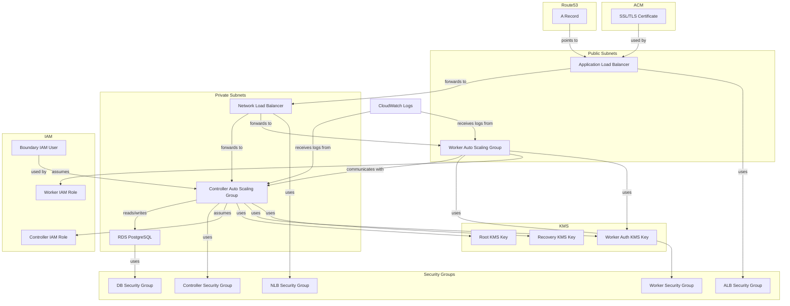

# Low-Level Architecture

This diagram represents the low-level architecture of the Boundary deployment on AWS using this Terraform module.

```mermaid
graph TD
    subgraph "Public Subnets"
        ALB[Application Load Balancer]
        WorkerASG[Worker Auto Scaling Group]
    end

    subgraph "Private Subnets"
        NLB[Network Load Balancer]
        ControllerASG[Controller Auto Scaling Group]
        RDS[RDS PostgreSQL]
    end

    subgraph "Security Groups"
        ALBSG[ALB Security Group]
        NLBSG[NLB Security Group]
        ControllerSG[Controller Security Group]
        WorkerSG[Worker Security Group]
        DBSG[DB Security Group]
    end

    subgraph "IAM"
        ControllerRole[Controller IAM Role]
        WorkerRole[Worker IAM Role]
        BoundaryUser[Boundary IAM User]
    end

    subgraph "KMS"
        RootKey[Root KMS Key]
        WorkerAuthKey[Worker Auth KMS Key]
        RecoveryKey[Recovery KMS Key]
    end

    subgraph "Route53"
        DNSRecord[A Record]
    end

    subgraph "ACM"
        Certificate[SSL/TLS Certificate]
    end

    ALB -->|forwards to| NLB
    NLB -->|forwards to| ControllerASG
    NLB -->|forwards to| WorkerASG
    ControllerASG -->|reads/writes| RDS
    WorkerASG -->|communicates with| ControllerASG

    ALB -->|uses| ALBSG
    NLB -->|uses| NLBSG
    ControllerASG -->|uses| ControllerSG
    WorkerASG -->|uses| WorkerSG
    RDS -->|uses| DBSG

    ControllerASG -->|assumes| ControllerRole
    WorkerASG -->|assumes| WorkerRole
    BoundaryUser -->|used by| ControllerASG

    ControllerASG -->|uses| RootKey
    ControllerASG -->|uses| WorkerAuthKey
    ControllerASG -->|uses| RecoveryKey
    WorkerASG -->|uses| WorkerAuthKey

    DNSRecord -->|points to| ALB
    Certificate -->|used by| ALB

    CloudWatchLogs[CloudWatch Logs] -->|receives logs from| ControllerASG
    CloudWatchLogs -->|receives logs from| WorkerASG

```
